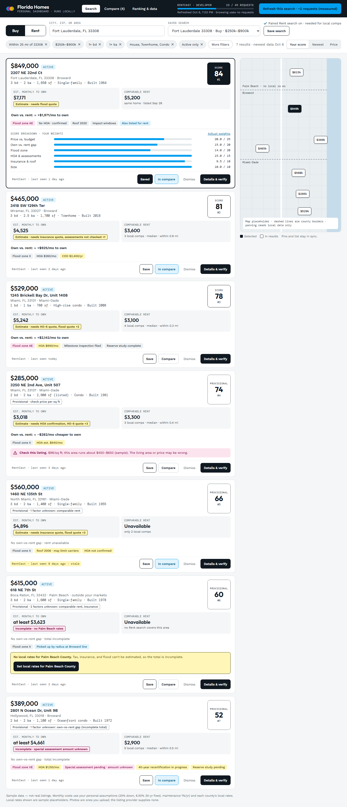
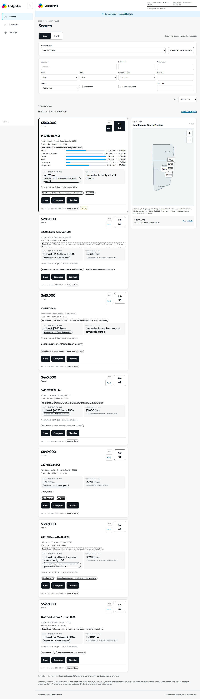
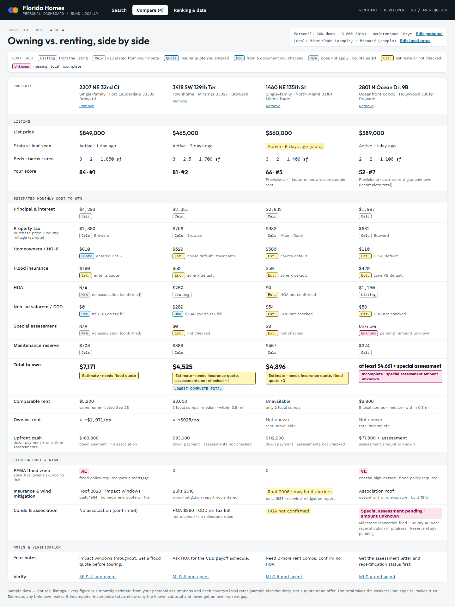
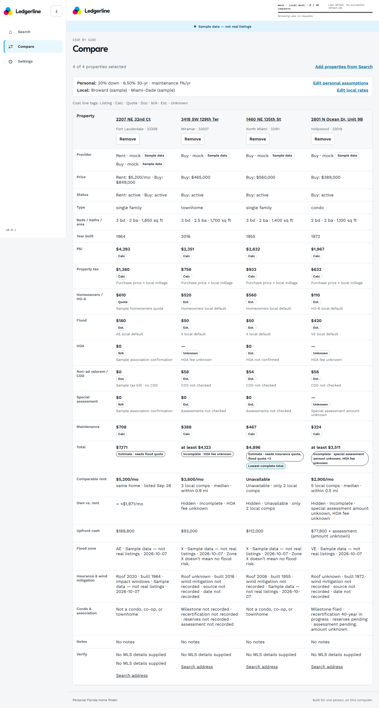
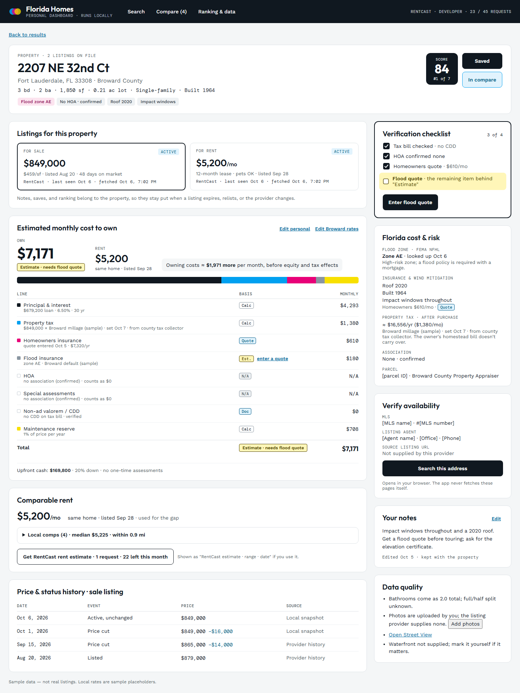
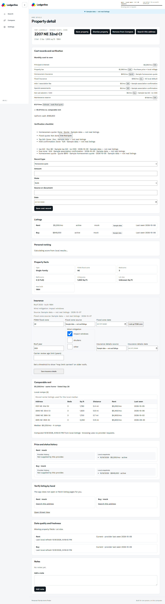
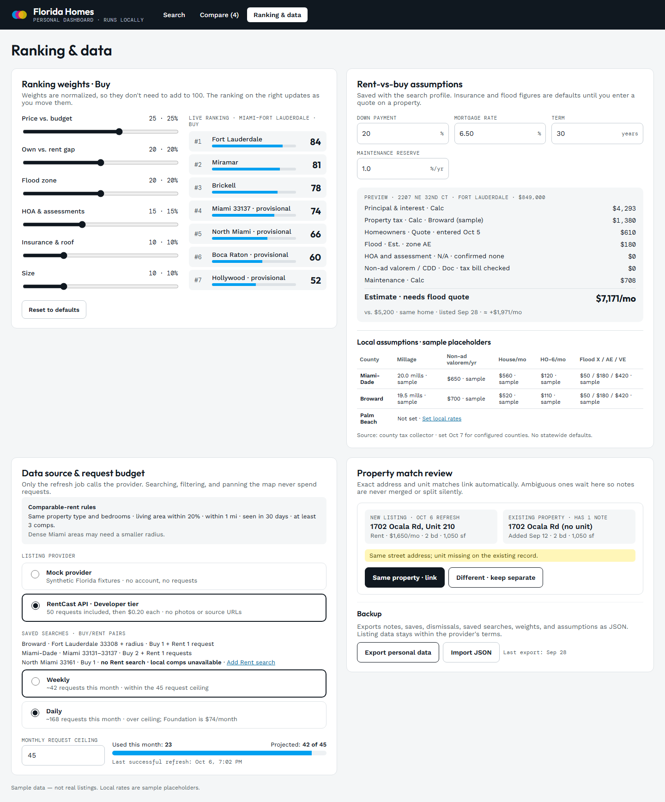
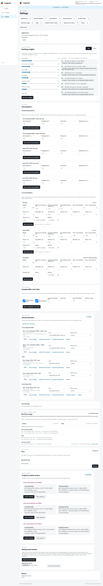

# Issue 80 screen comparison

These pairs show the four desktop screens at 1440 px. The left image is rendered from the checked-in `design/screens/*.dc.html` reference; the right image is the built app with its local mock provider, fixture homes, and no Maps key. The mock-up images are visual references only: labels and numbers in the app follow the plan, UI spec, and fixtures.

| Screen | Design mock-up | Built app |
| --- | --- | --- |
| Search |  |  |
| Compare |  |  |
| Property |  |  |
| Settings |  |  |

The built screens use the plan's desktop sidebar and **Settings** title; the mock-ups still show a top navigation bar and **Ranking & data**. Search has the later local filters and the map uses local county geometry with price pins at property coordinates. The Property page map belongs to issue C45; the current page keeps its Street View link. Appearance and Settings section order also follow the later plan. The mock-ups include earlier hand-set scores and examples, so the built app keeps computed scores, ranks, and cost figures.
